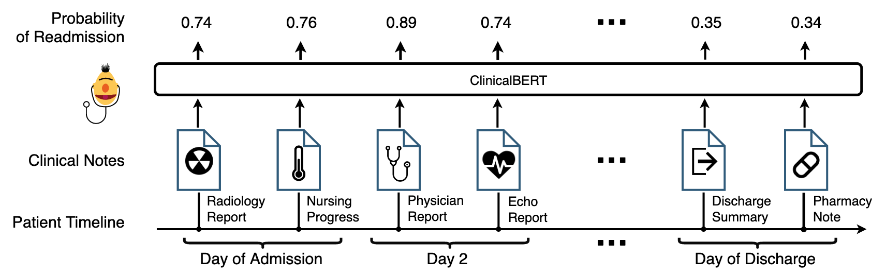
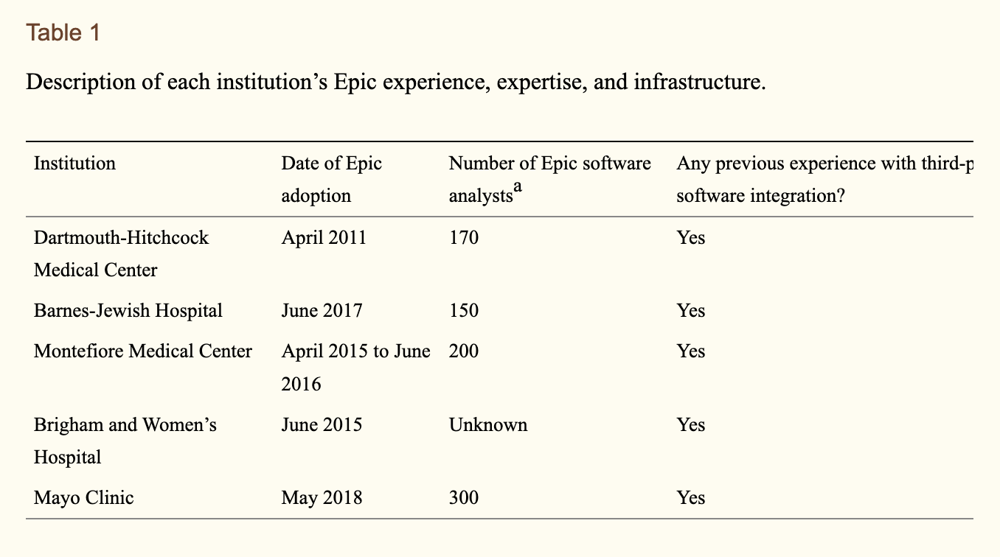
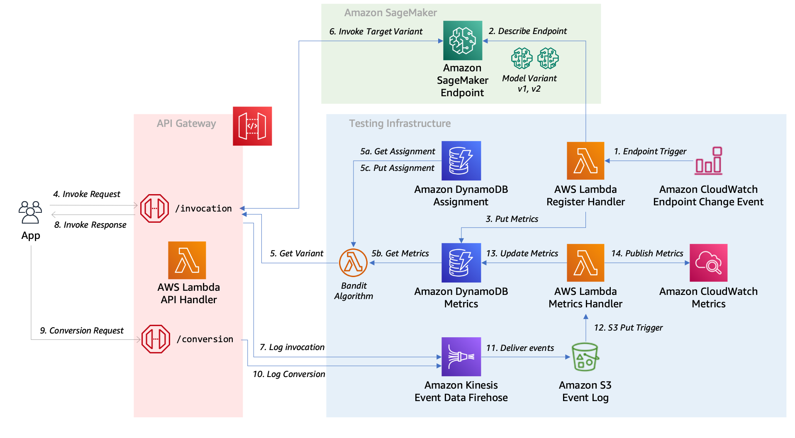
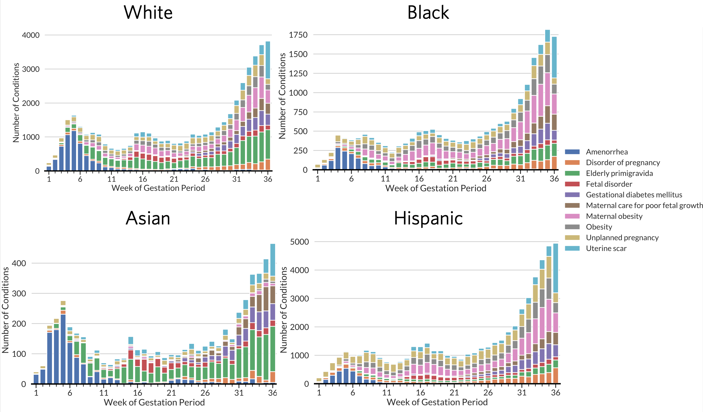
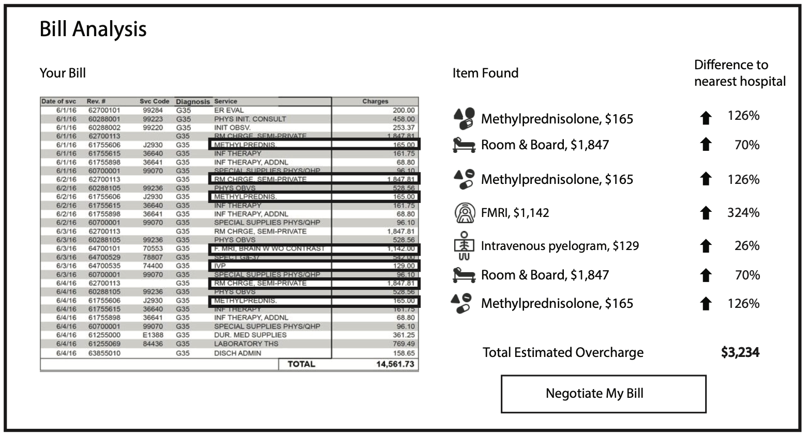

# Scaling Health Care Delivery

jaan@onefact.org  | [onefact.org/talks/umd](onefact.org/talks/umd)

## 

[Blowing up statue](https://www.ra.ee/wp-content/uploads/2017/02/KuuskPearu_Punaarmee_TUNA2002_4.pdf)

## 

</a>

##

## 

[https://archive.ph/2s7aJ](https://archive.ph/2s7aJ)

## 

 

DeepMind: faces [legal action](https://www.bbc.com/news/technology-58761324) from NHS due to deployment of [decision tree](https://s3-eu-west-1.amazonaws.com/files.royalfree.nhs.uk/Reporting/Streams_Report.pdf) 

##

## 

[libgen.rs/search.php?req=crisis+negotiations](https://libgen.rs/search.php?req=crisis+negotiations)

## 

## 

 

* [Texas Two step](https://www.npr.org/2022/01/07/1071181199/johnson-johnson-tests-a-legal-maneuver-known-as-the-texas-two-step)
* [Asbestos in talcum powder](https://www.reuters.com/investigates/special-report/johnsonandjohnson-cancer/)

## 

[ClinicalBERT](https://arxiv.org/abs/1904.05342)

## 

[Scalia et al. 2021](https://www.ncbi.nlm.nih.gov/pmc/articles/PMC8129884/)

## 

https://github.com/aws-samples/amazon-sagemaker-ab-testing-pipeline

## Misaligned incentives

* Payors seek to minimize cost

* Hospitals seek to increase cost and increase US News & World Report Rankings

* Doctors seek to care for patients and listen to leadership

* Patients seek better health

## Incentives leak into the data

<a href="../assets/age_significance_Black women_White women_conditions_before_bh_small.html">Demo</a>

(In collaboration with Noemie Elhadad (PI), Tony Sun, Harry Reyes, Charisse Madlock, Nicole Weiskopf.)

## 

## Price transparency

* [Health Care PRICE Transparency Act](https://www.congress.gov/bill/117th-congress/senate-bill/1524/text?r=4&s=1) passed in 2020

* Preliminary analysis showed 3x difference in off-label drugs between NYC boroughs

* Awarded $55k from [Brown Institute for Media Innovation](https://brown.columbia.edu/)

## Price transparency

## 

The One Fact Foundation conducts basic and applied research into open source technology that enhances health and agency at global scale.

## 
<table>
  <tr>
    <td> </td>
    <td></td>
    <td></td>
   </tr> 
</table>

## 
<table>
  <tr>
    <td> 
    </td>
    <td></td>
    <td></td>
   </tr> 
  <tr>
    <td> 
    </td>
    <td></td>
    <td></td>
   </tr> 
</table>

## 
<table>
  <tr>
    <td> 
    </td>
    <td></td>
   </tr> 
  <tr>

## 
<table>
  <tr>
    <td></td>
    <td> 
    </td>
    <td></td>
   </tr> 
  <tr>
    <td> 
    </td>
    <td></td>
   </tr> 
</table>